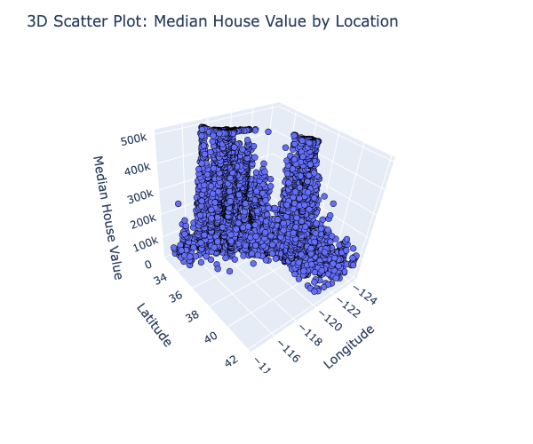

# Regression Analysis - Predicting California Housing Prices

## Overview

This project involves a regression analysis to predict housing prices in California using machine learning techniques. The dataset used is the California Housing Prices dataset obtained from Kaggle. The analysis includes feature engineering, linear regression using Ridge regression, and model evaluation using metrics such as Mean Absolute Error (MAE), Root Mean Squared Error (RMSE), and R-squared.

## Project Goals

The primary goals of this project are:

- Develop a predictive model for housing prices in California.
- Utilize feature engineering techniques to enhance model performance.
- Apply linear regression with Ridge regularization for accurate predictions.
- Evaluate model performance using appropriate metrics.

## Data Source

The dataset used in this project is the "California Housing Prices" dataset from Kaggle. It includes various features related to housing attributes and prices.

## Project Files

The main files in this project include:

- `Regression Analysis.ipynb`: The Jupyter Notebook containing the step-by-step analysis, modeling, and evaluation process.
- `housing.csv.zip`: The compressed dataset file used in the analysis.

## Libraries Used

The following Python libraries were used for this project:

- Pandas
- Scikit-Learn
- Seaborn
- Plotly Express
- Matplotlib

## How to Run

To replicate the analysis and results, follow these steps:

1. Clone the repository to your local machine.
2. Open the `Regression Analysis.ipynb` notebook using Jupyter Notebook or Jupyter Lab.
3. Run each cell in the notebook sequentially to replicate the analysis.

## Acknowledgments

The analysis and code in this project are developed by Bufatima N. k. The project was created as part of a data science learning journey.

## Author

Bufatima N. k.

GitHub: [github.com/Bufatima-Nk](https://github.com/Bufatima-Nk)
LinkedIn: [linkedin.com/in/bufatima-n-k](https://linkedin.com/in/bufatima-n-k)
